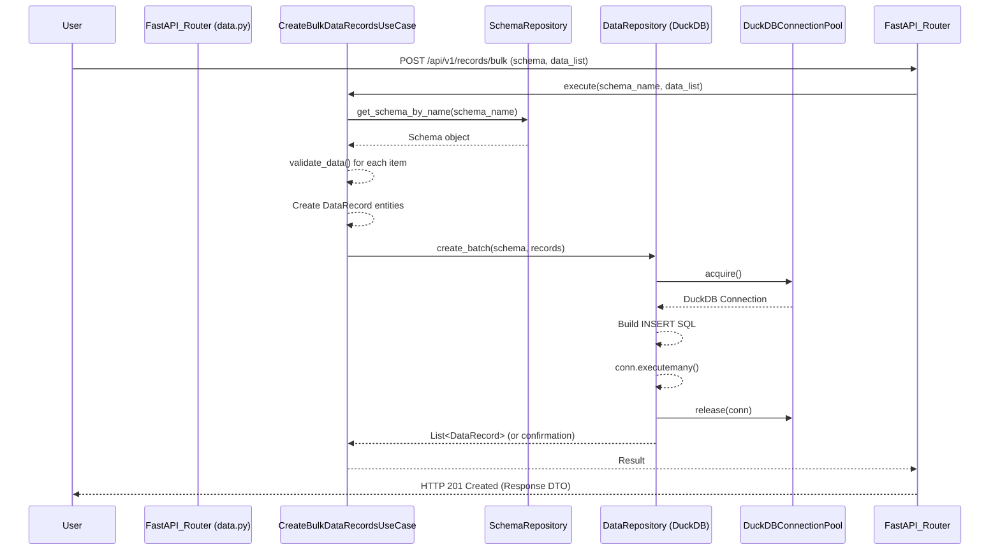
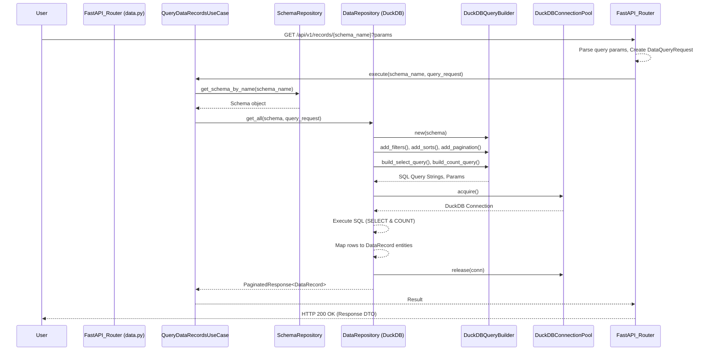

## 3. Architectural Flow and Component Analysis

### 3.1. Entry Point(s) and Initial State
The application initializes through FastAPI, as defined in `app/main.py`. A lifespan manager is configured to handle application startup and shutdown events, primarily managing the application's dependency injection container.

The core of the initialization process occurs within `app/container/container.py`. During startup, this container instantiates key services and components. This includes setting up the `AsyncDuckDBPool` for managing DuckDB connections, initializing the `DuckDBSchemaManager` responsible for table creation, creating instances of repositories (`FileSchemaRepository`, `DuckDBDataRepository`), and making use cases available for injection.

Schema loading is a critical part of the startup. The `FileSchemaRepository.initialize()` method is called, which loads schema definitions from the `SCHEMAS_METADATA` dictionary located in `app/infrastructure/metadata/schemas_description.py`. For each schema defined, it then calls `DuckDBSchemaManager.ensure_table_exists()`. This manager checks if a corresponding table for the schema exists in DuckDB and creates it, including any base indexes, if it doesn't.

Upon completion of the startup sequence, the application is ready to accept incoming API requests. The defined schemas are held in memory by the `FileSchemaRepository`, and the underlying DuckDB database has tables ensured for each of these schemas.

### 3.2. Key Functions/Modules/Components in the Architectural Flow

-   **`AsyncDuckDBPool` (`app/infrastructure/persistence/duckdb/connection_pool.py`):**
    -   Role: Manages a pool of DuckDB database connections. It aims to provide efficient connection reuse.
    -   Note: Internally, it wraps synchronous `duckdb.connect()` calls. Performance-related settings for DuckDB connections (e.g., memory limit, threads) are typically applied when these connections are established within the pool.

-   **`DuckDBSchemaManager` (`app/infrastructure/persistence/duckdb/schema_manager.py`):**
    -   Role: Responsible for translating `Schema` entity definitions into physical DuckDB tables. It ensures that a table exists for each defined schema and can create base indexes (e.g., on a primary key if specified, or other common query fields) to aid performance.

-   **`FileSchemaRepository` (`app/infrastructure/persistence/repositories/file_schema_repository.py`):**
    -   Role: Acts as the source of truth for `Schema` definitions within the application. It loads these definitions from a static Python structure (currently `schemas_description.py`) during initialization and provides `Schema` objects to other parts of the application, such as use cases and repositories.

-   **`DuckDBQueryBuilder` (`app/infrastructure/persistence/duckdb/query_builder.py`):**
    -   Role: A crucial component for database interaction, this class dynamically constructs SQL queries (SELECT, INSERT, UPDATE, DELETE, COUNT) tailored for DuckDB. It takes a `Schema` object and various query parameters like filters, sorting criteria, and pagination details to generate the appropriate SQL strings and parameter lists.

-   **`DuckDBDataRepository` (`app/infrastructure/persistence/repositories/duckdb_data_repository.py`):**
    -   Role: This class implements the `IDataRepository` interface, providing concrete data access logic for DuckDB. It handles Create, Read, Update, Delete (CRUD) operations. It utilizes the `DuckDBQueryBuilder` to generate SQL and the `AsyncDuckDBPool` to obtain database connections. It's also responsible for mapping data between database rows and `DataRecord` domain entities.

-   **Use Cases (e.g., `CreateBulkDataRecordsUseCase`, `QueryDataRecordsUseCase` in `app/application/use_cases/`):**
    -   Role: These classes orchestrate the application's business logic, aligning with the CQRS pattern. They are invoked by the API layer (routers). They typically fetch necessary `Schema` objects, perform data validation (often delegated to the `Schema` entity itself), and then use data repositories (like `DuckDBDataRepository`) for data persistence or retrieval.

-   **FastAPI Routers (e.g., `data.py` in `app/infrastructure/web/routers/`):**
    -   Role: Define the API endpoints (e.g., `/api/v1/records/...`). They handle incoming HTTP requests, validate request payloads and parameters using Pydantic-based Data Transfer Objects (DTOs), and then invoke the appropriate application use cases to process the request. They also format and return HTTP responses.

### 3.3. Execution Flow Tracing (Examples)

**A. Write Operation (Bulk Create Example):**
      - User sends POST request to `/api/v1/records/bulk` with schema name and list of data.
      - `data.py`: `create_bulk_data_records` endpoint receives request, validates with `CreateBulkDataRequest` DTO.
      - Invokes `container.create_bulk_data_records_use_case.execute()`.
      - `CreateBulkDataRecordsUseCase`:
         - Fetches `Schema` using `schema_repository.get_schema_by_name()`.
         - Iterates through data list, calls `schema.validate_data()` for each item.
         - Creates `DataRecord` entity instances.
         - Calls `data_repository.create_batch(schema, records)`.
      - `DuckDBDataRepository.create_batch()`:
         - Acquires connection from `AsyncDuckDBPool`.
         - Constructs an `INSERT INTO ...` SQL query.
         - Uses `conn.executemany()` to insert data.
         - Releases connection.
      - Response is mapped to `CreateBulkDataResponse` and returned.

**B. Read Operation (Query Records Example):**
      - User sends GET request to `/api/v1/records/{schema_name}` with query parameters (filters, sort, pagination).
      - `data.py`: `get_records_by_schema` endpoint receives request.
      - Parses query parameters (filters, sort) from JSON strings.
      - Creates `DataQueryRequest` DTO.
      - Invokes `container.query_data_records_use_case.execute()`.
      - `QueryDataRecordsUseCase`:
         - Fetches `Schema` using `schema_repository.get_schema_by_name()`.
         - Calls `data_repository.get_all(schema, query_request)`.
      - `DuckDBDataRepository.get_all()`:
         - Instantiates `DuckDBQueryBuilder(schema)`.
         - Adds filters, sorts, pagination to query builder.
         - Builds SELECT and COUNT queries using `query_builder.build_select_query()` and `query_builder.build_count_query()`.
         - Acquires connection from `AsyncDuckDBPool`.
         - Executes queries (`conn.execute().fetchall()`, `conn.execute().fetchone()`).
         - Maps results to `DataRecord` entities.
         - Releases connection.
      - Returns `PaginatedResponse[DataRecord]`.
      - Response is mapped to `QueryDataRecordsResponse` and returned.

### 3.4. Data State and Flow Analysis
Data state within the application is primarily managed and persisted within the DuckDB database. The structure and rules for this data are dictated by `Schema` objects.

These `Schema` objects, loaded at startup from `app/infrastructure/metadata/schemas_description.py`, are central to nearly all data-related operations:
-   They define the logical table names and the properties (fields) of the data, including their names, Python types (`property_type`), and corresponding DuckDB types (`db_type`).
-   Incoming data for write operations is validated against these schema definitions using the `Schema.validate_data()` method, ensuring type correctness and adherence to any defined constraints.
-   The `DuckDBQueryBuilder` relies heavily on `Schema` objects to dynamically construct SQL queries that are appropriate for the target table and its columns.
-   The `DuckDBDataRepository` uses schema information to map data from database rows into `DataRecord` entity instances (and vice-versa for writes, though currently, inserts are direct from structured data).

The general data flow follows a layered approach:
1.  An external HTTP request arrives at a FastAPI router.
2.  The router validates the request using Pydantic-based Data Transfer Objects (DTOs).
3.  The router invokes an appropriate application use case.
4.  The use case fetches the relevant `Schema`, validates data if it's a write operation, and prepares domain entities like `DataRecord`.
5.  The use case calls methods on a data repository (e.g., `DuckDBDataRepository`).
6.  The repository interacts with DuckDB, using the connection pool and query builder.
7.  Data flows back through this chain, with repository methods returning domain entities, use cases processing these into response DTOs, and routers sending the final HTTP response.

A key design aspect is its generic nature: the same core components (query builder, data repository, use cases for CRUD) are designed to handle data operations for any schema defined in `schemas_description.py`. This makes the system extensible to new data types without requiring new endpoint implementations or repository logic for each new schema, embodying the schema-driven approach.
