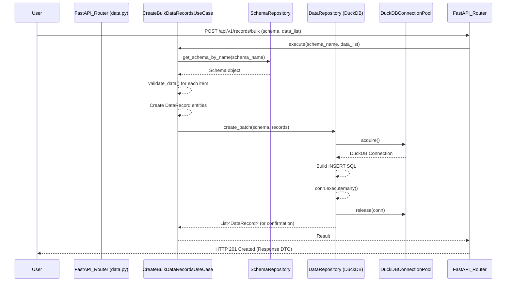
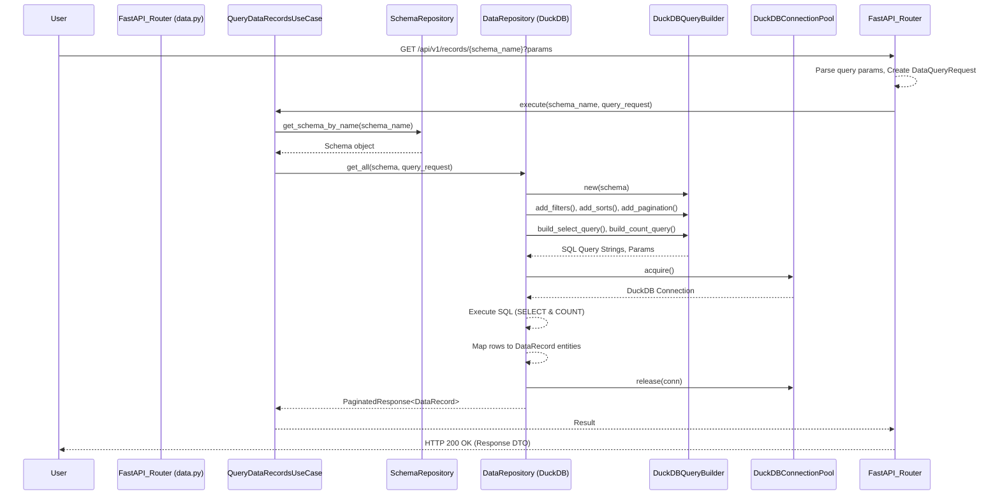

# Bug Analysis Report: Design and Performance Analysis for High-Scale Data Platform

## 1. Executive Summary

The purpose of this analysis is to review the current design and implementation of the high-scale data platform against the project's goals. These goals include achieving high performance for both read and write operations, maintaining a schema-oriented design, ensuring modularity, adhering to hexagonal architecture principles, following DRY (Don't Repeat Yourself) principles, proving suitability for commercial scale operations, and demonstrating the capability to handle millions of records efficiently.

The most likely areas of potential concern, identified at a high level, revolve around database scalability, particularly for write-intensive workloads using DuckDB. Other areas include potential memory inefficiencies in data handling processes when dealing with large datasets, the impact of the current indexing strategy (or lack thereof) on query performance, and opportunities for refining DuckDB's configuration to better suit the platform's specific needs.

Key code areas/modules primarily involved in this analysis include: `app/config/settings.py` for configuration parameters, `app/infrastructure/persistence/duckdb/` for DuckDB specific implementations, `app/infrastructure/persistence/repositories/duckdb_data_repository.py` for data interaction logic, `app/domain/entities/schema.py` for schema definitions, and `app/application/use_cases/` which orchestrate the application's operations.

## 2. Project Goals and Design Context (from User Task and README)

### Project Goals (User Task)
The system aims for high-performance read and write operations, a schema-oriented design, modularity, adherence to hexagonal architecture, DRY principles, suitability for commercial scale, and the capacity to handle millions of records.

### Architectural Overview (README)
The platform uses FastAPI as its web framework and DuckDB for database operations in its MVP. It is schema-driven, with definitions currently stored in Python files. The architecture is based on Hexagonal (Ports & Adapters), Domain-Driven Design (DDD), Command Query Responsibility Segregation (CQRS), Dependency Injection (DI), and uses Pydantic for data validation and modeling. The core logic is separated into domain, application, and infrastructure layers.

### Observed Behavior
This report is the result of a design and performance review request. It does not stem from a specific observed malfunction with reproducible steps but rather an analysis of the existing codebase against its stated architectural and performance goals.

### Expected Behavior
The system is expected to effectively meet the outlined project goals, ensuring high performance, scalability, and maintainability as it handles large volumes of data in a schema-driven manner.

### Steps to Reproduce (STR)
Not Applicable (N/A) for a design and performance review.

### Environment
Analysis is based on the provided 'react-fast-V12' codebase.

### Error Messages (if any)
Not Applicable (N/A).

## 3. Architectural Flow and Component Analysis

### 3.1. Entry Point(s) and Initial State
The application initializes through FastAPI, as defined in `app/main.py`. A lifespan manager is configured to handle application startup and shutdown events, primarily managing the application's dependency injection container.

The core of the initialization process occurs within `app/container/container.py`. During startup, this container instantiates key services and components. This includes setting up the `AsyncDuckDBPool` for managing DuckDB connections, initializing the `DuckDBSchemaManager` responsible for table creation, creating instances of repositories (`FileSchemaRepository`, `DuckDBDataRepository`), and making use cases available for injection.

Schema loading is a critical part of the startup. The `FileSchemaRepository.initialize()` method is called, which loads schema definitions from the `SCHEMAS_METADATA` dictionary located in `app/infrastructure/metadata/schemas_description.py`. For each schema defined, it then calls `DuckDBSchemaManager.ensure_table_exists()`. This manager checks if a corresponding table for the schema exists in DuckDB and creates it, including any base indexes, if it doesn't.

Upon completion of the startup sequence, the application is ready to accept incoming API requests. The defined schemas are held in memory by the `FileSchemaRepository`, and the underlying DuckDB database has tables ensured for each of these schemas.

### 3.2. Key Functions/Modules/Components in the Architectural Flow

-   **`AsyncDuckDBPool` (`app/infrastructure/persistence/duckdb/connection_pool.py`):**
    -   Role: Manages a pool of DuckDB database connections. It aims to provide efficient connection reuse.
    -   Note: Internally, it wraps synchronous `duckdb.connect()` calls. Performance-related settings for DuckDB connections (e.g., memory limit, threads) are typically applied when these connections are established within the pool.

-   **`DuckDBSchemaManager` (`app/infrastructure/persistence/duckdb/schema_manager.py`):**
    -   Role: Responsible for translating `Schema` entity definitions into physical DuckDB tables. It ensures that a table exists for each defined schema and can create base indexes (e.g., on a primary key if specified, or other common query fields) to aid performance.

-   **`FileSchemaRepository` (`app/infrastructure/persistence/repositories/file_schema_repository.py`):**
    -   Role: Acts as the source of truth for `Schema` definitions within the application. It loads these definitions from a static Python structure (currently `schemas_description.py`) during initialization and provides `Schema` objects to other parts of the application, such as use cases and repositories.

-   **`DuckDBQueryBuilder` (`app/infrastructure/persistence/duckdb/query_builder.py`):**
    -   Role: A crucial component for database interaction, this class dynamically constructs SQL queries (SELECT, INSERT, UPDATE, DELETE, COUNT) tailored for DuckDB. It takes a `Schema` object and various query parameters like filters, sorting criteria, and pagination details to generate the appropriate SQL strings and parameter lists.

-   **`DuckDBDataRepository` (`app/infrastructure/persistence/repositories/duckdb_data_repository.py`):**
    -   Role: This class implements the `IDataRepository` interface, providing concrete data access logic for DuckDB. It handles Create, Read, Update, Delete (CRUD) operations. It utilizes the `DuckDBQueryBuilder` to generate SQL and the `AsyncDuckDBPool` to obtain database connections. It's also responsible for mapping data between database rows and `DataRecord` domain entities.

-   **Use Cases (e.g., `CreateBulkDataRecordsUseCase`, `QueryDataRecordsUseCase` in `app/application/use_cases/`):**
    -   Role: These classes orchestrate the application's business logic, aligning with the CQRS pattern. They are invoked by the API layer (routers). They typically fetch necessary `Schema` objects, perform data validation (often delegated to the `Schema` entity itself), and then use data repositories (like `DuckDBDataRepository`) for data persistence or retrieval.

-   **FastAPI Routers (e.g., `data.py` in `app/infrastructure/web/routers/`):**
    -   Role: Define the API endpoints (e.g., `/api/v1/records/...`). They handle incoming HTTP requests, validate request payloads and parameters using Pydantic-based Data Transfer Objects (DTOs), and then invoke the appropriate application use cases to process the request. They also format and return HTTP responses.

### 3.3. Execution Flow Tracing (Examples)

**A. Write Operation (Bulk Create Example):**
      - User sends POST request to `/api/v1/records/bulk` with schema name and list of data.
      - `data.py`: `create_bulk_data_records` endpoint receives request, validates with `CreateBulkDataRequest` DTO.
      - Invokes `container.create_bulk_data_records_use_case.execute()`.
      - `CreateBulkDataRecordsUseCase`:
         - Fetches `Schema` using `schema_repository.get_schema_by_name()`.
         - Iterates through data list, calls `schema.validate_data()` for each item.
         - Creates `DataRecord` entity instances.
         - Calls `data_repository.create_batch(schema, records)`.
      - `DuckDBDataRepository.create_batch()`:
         - Acquires connection from `AsyncDuckDBPool`.
         - Constructs an `INSERT INTO ...` SQL query.
         - Uses `conn.executemany()` to insert data.
         - Releases connection.
      - Response is mapped to `CreateBulkDataResponse` and returned.



**B. Read Operation (Query Records Example):**
      - User sends GET request to `/api/v1/records/{schema_name}` with query parameters (filters, sort, pagination).
      - `data.py`: `get_records_by_schema` endpoint receives request.
      - Parses query parameters (filters, sort) from JSON strings.
      - Creates `DataQueryRequest` DTO.
      - Invokes `container.query_data_records_use_case.execute()`.
      - `QueryDataRecordsUseCase`:
         - Fetches `Schema` using `schema_repository.get_schema_by_name()`.
         - Calls `data_repository.get_all(schema, query_request)`.
      - `DuckDBDataRepository.get_all()`:
         - Instantiates `DuckDBQueryBuilder(schema)`.
         - Adds filters, sorts, pagination to query builder.
         - Builds SELECT and COUNT queries using `query_builder.build_select_query()` and `query_builder.build_count_query()`.
         - Acquires connection from `AsyncDuckDBPool`.
         - Executes queries (`conn.execute().fetchall()`, `conn.execute().fetchone()`).
         - Maps results to `DataRecord` entities.
         - Releases connection.
      - Returns `PaginatedResponse[DataRecord]`.
      - Response is mapped to `QueryDataRecordsResponse` and returned.



### 3.4. Data State and Flow Analysis
Data state within the application is primarily managed and persisted within the DuckDB database. The structure and rules for this data are dictated by `Schema` objects.

These `Schema` objects, loaded at startup from `app/infrastructure/metadata/schemas_description.py`, are central to nearly all data-related operations:
-   They define the logical table names and the properties (fields) of the data, including their names, Python types (`property_type`), and corresponding DuckDB types (`db_type`).
-   Incoming data for write operations is validated against these schema definitions using the `Schema.validate_data()` method, ensuring type correctness and adherence to any defined constraints.
-   The `DuckDBQueryBuilder` relies heavily on `Schema` objects to dynamically construct SQL queries that are appropriate for the target table and its columns.
-   The `DuckDBDataRepository` uses schema information to map data from database rows into `DataRecord` entity instances (and vice-versa for writes, though currently, inserts are direct from structured data).

The general data flow follows a layered approach:
1.  An external HTTP request arrives at a FastAPI router.
2.  The router validates the request using Pydantic-based Data Transfer Objects (DTOs).
3.  The router invokes an appropriate application use case.
4.  The use case fetches the relevant `Schema`, validates data if it's a write operation, and prepares domain entities like `DataRecord`.
5.  The use case calls methods on a data repository (e.g., `DuckDBDataRepository`).
6.  The repository interacts with DuckDB, using the connection pool and query builder.
7.  Data flows back through this chain, with repository methods returning domain entities, use cases processing these into response DTOs, and routers sending the final HTTP response.

A key design aspect is its generic nature: the same core components (query builder, data repository, use cases for CRUD) are designed to handle data operations for any schema defined in `schemas_description.py`. This makes the system extensible to new data types without requiring new endpoint implementations or repository logic for each new schema, embodying the schema-driven approach.

## 4. Potential Design/Performance Issues and Hypotheses

### 4.1. Hypothesis 1: Database Scalability for Writes/Concurrency with DuckDB
-   **Rationale/Evidence:** DuckDB is an embedded Online Analytical Processing (OLAP) database, primarily designed and excelling at analytical queries over large datasets. While it robustly supports write operations, its typical architecture involves a single writer per database file or a single active writer to a database instance within a given process. This characteristic might become a significant bottleneck for high-concurrency transactional write workloads, which are often implied by "commercial scale" operations. The current `AsyncDuckDBPool` wraps synchronous DuckDB connection calls (`duckdb.connect()`). If these synchronous operations (like `execute`, `executemany`) are not explicitly offloaded to a separate thread pool when used in an asyncio environment, they can block the main asyncio event loop. This would limit the true concurrency achievable by a single Python process, regardless of the number of pooled connections. The project explicitly aims for "high performance read and write operations" and the capacity to handle "millions of records."
-   **Code (if relevant):**
    ```python
    // app/infrastructure/persistence/duckdb/connection_pool.py - _create_connection & acquire
    // perf_config_list = []
    // for key, value in self.performance_config.items():
    //     perf_config_list.append(f"SET {key} = '{value}';")
    // perf_config = " ".join(perf_config_list)
    // conn = duckdb.connect(database=self.database_path, config={'query_config': perf_config})
    // # Note: The above config parameter for duckdb.connect is likely incorrect. Settings are usually applied via execute().
    // # And later, in _create_connection method, it has:
    // # conn.execute("SET memory_limit = '4GB';")
    // # conn.execute("SET threads = 4;")
    // # (No explicit offloading to thread pool for sync operations is visible in the provided snippets for acquire/release)

    // app/infrastructure/persistence/repositories/duckdb_data_repository.py - create, create_batch
    // async with self.connection_pool.acquire() as conn:
    //     # ... build insert_sql ...
    //     conn.execute(insert_sql, values)
    // # For create_batch:
    // async with self.connection_pool.acquire() as conn:
    //     # ...
    //     conn.executemany(insert_sql, values_to_insert)
    ```
-   **How it leads to the issue:** Under high concurrent write loads (e.g., many users or services attempting to insert or update data simultaneously), requests may queue up due to the single-writer nature or experience significant latency if synchronous database calls block the event loop. This would fail to meet the "high performance" write goals. Scaling out API instances (horizontal scaling) might alleviate pressure on individual Python processes but would likely shift the bottleneck more intensely to the single database writer capability of a single DuckDB file, unless a multi-process access mode (like MotherDuck or a self-managed DuckDB server instance) or a different database architecture designed for concurrent writes is used. The current setup does not indicate such a configuration.

### 4.2. Hypothesis 2: Memory Inefficiencies in Data Handling
-   **Rationale/Evidence:**
    1.  **Streaming Simulation vs. True Streaming:** The `stream_query_results` method in `DuckDBDataRepository` is intended to provide results iteratively. However, it currently uses `result_relation.fetchall()` to retrieve all matching rows into memory *before* starting to yield them one by one. For queries that could return millions of records, this approach would load the entire dataset into the application's memory first. The code comment `INFO: Use traditional fetchall for streaming as DuckDB streaming can be problematic with a connection from a pool and async code` suggests a known underlying issue or a deliberate workaround that sacrifices memory efficiency for correctness or simplicity in the current async/connection pool context.
    2.  **Bulk Operations Memory Usage:** In `CreateBulkDataRecordsUseCase`, the system validates all data records within an incoming list and then instantiates `DataRecord` objects for the *entire batch* in memory *before* dispatching them to the database's `create_batch` method. The `MAX_BULK_RECORDS` constant is set to 100,001. If a batch approaches this size, storing 100,001 `DataRecord` objects, each potentially containing non-trivial data, could consume a significant amount of memory.
-   **Code (if relevant):**
    ```python
    // app/infrastructure/persistence/repositories/duckdb_data_repository.py - stream_query_results
    // async with self.connection_pool.acquire() as conn:
    //     # ... build query ...
    //     result_relation = conn.execute(sql_query, params)
    //     if result_relation:
    //         description = result_relation.description
    //         rows = result_relation.fetchall() # All rows loaded into memory here
    //         # INFO: Use traditional fetchall for streaming as DuckDB streaming can be problematic
    //         # with a connection from a pool and async code.
    //         for row in rows: # Iterating over in-memory list
    //             yield self._map_row_to_data_record(schema, row, description)

    // app/application/use_cases/create_bulk_data_records.py - execute
    // records_to_create: list[DataRecord] = []
    // for i, data_item in enumerate(data_list):
    //     # Validate data (can throw error)
    //     self.schema_validator.validate_data(schema_obj, data_item)
    //     record = DataRecord(schema_name=schema_obj.name, data=data_item)
    //     records_to_create.append(record)
    // # All DataRecord objects for the batch are in the records_to_create list in memory
    // created_records = await self.data_repository.create_batch(schema_obj, records_to_create)
    ```
-   **How it leads to the issue:** These patterns can lead to high memory consumption within the application instances. For very large query result sets or maximum-sized bulk operations, this could cause Out-Of-Memory (OOM) errors, especially when dealing with the target of "millions of records." This impacts system stability, reliability, and the actual number of concurrent operations the system can handle before running into memory limits.

### 4.3. Hypothesis 3: Insufficient Indexing Strategy for Dynamic Schemas
-   **Rationale/Evidence:** The `DuckDBSchemaManager.ensure_table_exists` method is responsible for creating tables in DuckDB based on schema definitions. Currently, it creates tables and then explicitly adds indexes only for the `id` (primary key) and `created_at` columns. For a system designed to handle "millions of records" across various dynamically defined schemas (via `schemas_description.py`), queries will inevitably need to filter or sort data based on other properties specific to each schema. Without indexes on these frequently queried custom fields, DuckDB will be forced to perform full table scans, leading to significant performance degradation as the table size grows.
-   **Code (if relevant):**
    ```python
    // app/infrastructure/persistence/duckdb/schema_manager.py - ensure_table_exists
    // async def ensure_table_exists(self, schema: Schema, conn: duckdb.DuckDBPyConnection) -> None:
    //     # ... (table creation logic) ...
    //     # Create index for id and created_at
    //     # TODO: Add indexes for other queryable fields if necessary for performance
    //     conn.execute(f'CREATE INDEX IF NOT EXISTS "idx_{schema.table_name}_id" ON "{schema.table_name}"(id);')
    //     conn.execute(f'CREATE INDEX IF NOT EXISTS "idx_{schema.table_name}_created_at" ON "{schema.table_name}"(created_at);')
    //     # (No dynamic index creation based on other schema properties or query patterns)
    ```
-   **How it leads to the issue:** This limited indexing strategy will likely fail to meet the "high performance read operations" goal for many common query patterns that filter or sort on non-indexed fields. Full table scans on tables with millions of records are computationally expensive and slow, directly impacting user experience and system efficiency. The "TODO" comment indicates awareness but not implementation.

### 4.4. Hypothesis 4: Suboptimal DuckDB Configuration and Management
-   **Rationale/Evidence:**
    -   DuckDB's performance can be tuned via settings like `memory_limit` and `threads`. These are defined in `app/config/settings.py` (e.g., `DUCKDB_PERFORMANCE_CONFIG` with '8GB' memory, 4 threads).
    -   However, within `AsyncDuckDBPool._create_connection`, these settings appear to be hardcoded again, with `memory_limit` set to '4GB' and `threads` to 4 via `conn.execute("SET ...")` calls. This creates a discrepancy and overrides the external configuration, potentially leading to confusion or suboptimal settings if the external configuration is intended to be the source of truth.
    -   The `temp_directory` for DuckDB is configured via `settings.DUCKDB_TEMP_DIRECTORY`, which defaults to a system-specific temporary path. While generally acceptable, the performance characteristics (disk speed, available space) of this temporary storage can significantly impact large sort operations, aggregations, or joins that spill to disk. This might not always be optimal for a "commercial scale" deployment without explicit consideration.
-   **Code (if relevant):**
    ```python
    // app/config/settings.py
    // DUCKDB_PERFORMANCE_CONFIG: dict[str, Any] = {
    //     'memory_limit': '8GB', # This seems to be ignored or overridden
    //     'threads': 4,
    //     # ... other settings
    // }

    // app/infrastructure/persistence/duckdb/connection_pool.py - _create_connection
    // def _create_connection(self) -> duckdb.DuckDBPyConnection:
    //     # ...
    //     conn = duckdb.connect(database=self.database_path, read_only=self.read_only)
    //     # Apply performance settings - these are hardcoded here
    //     conn.execute("SET memory_limit = '4GB';")
    //     conn.execute("SET threads = 4;")
    //     conn.execute(f"SET temp_directory = '{self.temp_directory}';")
    //     # ...
    //     return conn
    ```
-   **How it leads to the issue:** Leads to inefficient resource utilization (e.g., memory settings not matching available system resources or workload needs), potential instability if effective memory limits are too low for complex analytical queries on large datasets, or underutilization of available hardware. The fixed thread count might not be ideal for all deployment scenarios (CPU-bound vs. I/O-bound workloads). The discrepancy in configuration sources is also a maintenance concern.

### 4.5. Hypothesis 5: Type Coupling with `db_type` in Schema (Lower Severity)
-   **Rationale/Evidence:** The `SchemaProperty` domain entity model, defined in `app/domain/entities/schema.py`, includes a `db_type` field. This field is intended to store database-specific type information (e.g., "VARCHAR", "BIGINT", "TIMESTAMP WITH TIME ZONE"), which is directly related to DuckDB's SQL dialect. While the project currently targets DuckDB as its sole database, this introduces a direct coupling in a domain entity definition to specific infrastructure (database) concerns.
-   **Code (if relevant):**
    ```python
    // app/domain/entities/schema.py
    // class SchemaProperty(BaseModel):
    //    name: str
    //    type: Literal["string", "integer", "number", "boolean", "object", "array", "date", "datetime"]
    //    db_type: str # Example: "VARCHAR", "BIGINT", "DOUBLE", "BOOLEAN", "JSON", "ARRAY(VARCHAR)", "DATE", "TIMESTAMP WITH TIME ZONE"
    //    required: bool = False
    //    is_indexed: bool = False # Added in a later version, but relevant to schema definition
    //    is_unique: bool = False  # Added in a later version
    //    default: Any | None = None
    //    description: str | None = None
    ```
-   **How it leads to the issue:** This design choice slightly deviates from strict hexagonal architecture principles, where the domain model should ideally be independent of infrastructure specifics. If the system were to evolve to support other database systems in the future (e.g., PostgreSQL, MySQL), the `db_type` field within the core `SchemaProperty` domain entity would need to be re-evaluated, potentially requiring modifications or an additional mapping layer to translate between a generic domain type and database-specific types. For the current MVP scope focused solely on DuckDB, this is not an immediate operational problem but represents a minor architectural impurity that could affect future flexibility.

### 4.6. Most Likely Issues for "Commercial Scale" Goals
Based on the project's ambition to handle "millions of records" with "high performance" in a "commercial scale" application, the following hypotheses represent the most significant risks to achieving these goals:

1.  **Database Scalability for Writes/Concurrency with DuckDB (Hypothesis 1):** This is fundamental. If the database cannot handle the required volume of concurrent writes or data ingestion rates, the entire system will suffer. This impacts the "high performance write operations" and "commercial scale" goals.
2.  **Memory Inefficiencies in Data Handling (Hypothesis 2):** Processing "millions of records" or large batches/streams requires careful memory management. Current practices of loading large datasets into memory before processing can lead to instability and limit throughput, affecting reliability and performance.
3.  **Insufficient Indexing Strategy (Hypothesis 3):** Essential for "high performance read operations" on large datasets. Without appropriate indexes on commonly queried fields, query times will become unacceptable as data volume grows.

These three areas are critical and should be prioritized for investigation and potential remediation to ensure the platform can meet its stated objectives.

## 5. Supporting Evidence from Code

This section consolidates observations about specific code areas that underpin the hypotheses detailed in Section 4. The most relevant code snippets have already been included directly within each hypothesis's description in Section 4 for contextual clarity and to avoid redundancy. Below is a summary of key files and their direct relation to the identified potential design and performance issues:

-   **`app/infrastructure/persistence/duckdb/connection_pool.py`**:
    -   This file is central to how the application interacts with DuckDB. It illustrates the current connection management strategy, including how connections are created (`_create_connection`) and acquired (`acquire`).
    -   Critically, it shows where performance-related settings for DuckDB (e.g., `SET memory_limit = '4GB'`, `SET threads = 4;`) are hardcoded, potentially overriding configurations intended in `app/config/settings.py`.
    -   The synchronous nature of `duckdb.connect()` and connection operations within an async pool without explicit thread offloading is also evident here.
    -   Relevant to: *Hypothesis 1 (Database Scalability for Writes/Concurrency with DuckDB)* and *Hypothesis 4 (Suboptimal DuckDB Configuration and Management)*.

-   **`app/infrastructure/persistence/repositories/duckdb_data_repository.py`**:
    -   This repository implementation contains the `stream_query_results` method, which uses `fetchall()`. This is a key piece of evidence for potential memory inefficiency when streaming large query results, as the entire result set is loaded into memory.
    -   The direct use of `conn.execute()` and `conn.executemany()` for write operations is shown here, providing insight into how data is persisted and how write operations might contend or block.
    -   Relevant to: *Hypothesis 1 (Database Scalability for Writes/Concurrency with DuckDB)* and *Hypothesis 2 (Memory Inefficiencies in Data Handling)*.

-   **`app/application/use_cases/create_bulk_data_records.py`**:
    -   The `execute` method in this use case demonstrates the pattern of validating all data items in a bulk request and creating a list of `DataRecord` domain objects for the entire batch *before* submitting these to the database repository.
    -   This supports the concern about potential high memory usage for large bulk operations.
    -   Relevant to: *Hypothesis 2 (Memory Inefficiencies in Data Handling)*.

-   **`app/infrastructure/persistence/duckdb/schema_manager.py`**:
    -   The `ensure_table_exists` method within this file explicitly shows the current indexing strategy. It details the creation of indexes only for `id` and `created_at` columns.
    -   The absence of logic to create indexes on other schema-defined properties is key evidence for the hypothesis regarding insufficient indexing.
    -   Relevant to: *Hypothesis 3 (Insufficient Indexing Strategy for Dynamic Schemas)*.

-   **`app/domain/entities/schema.py`**:
    -   The definition of the `SchemaProperty` class within this core domain entity file includes the `db_type` attribute. This attribute is intended to hold database-specific type names (e.g., "VARCHAR", "BIGINT").
    -   This directly illustrates the coupling of the domain model to database-specific details.
    -   Relevant to: *Hypothesis 5 (Type Coupling with `db_type` in Schema)*.

-   **`app/config/settings.py`**:
    -   This file contains the `DUCKDB_PERFORMANCE_CONFIG` dictionary, where application-level configurations for DuckDB (like memory limits and thread counts) are intended to be defined.
    -   The fact that these settings are, in part, overridden or ignored by hardcoded values in the `connection_pool.py` is crucial for understanding configuration discrepancies.
    -   Relevant to: *Hypothesis 4 (Suboptimal DuckDB Configuration and Management)*.

Detailed code snippets supporting these points are co-located with their respective hypotheses in Section 4 for better readability and immediate context. This section serves to reaffirm that the hypotheses are derived from and can be traced back to specific implementations within the existing codebase.

## 6. Recommended Steps for Validation and Improvement

To validate the hypotheses and guide improvements towards achieving the project's goals for performance and scalability, the following steps are recommended:

### 6.1. Enhanced Logging & Monitoring
   - **Detailed Performance Logging:**
     - Augment existing logging in use cases and repositories (especially `DuckDBDataRepository`) to capture critical performance metrics more granularly. This should include:
       - Precise execution time for all database query methods (e.g., `get_by_id`, `get_all`, `create`, `create_batch`, `stream_query_results`).
       - Time taken for data validation steps, particularly within bulk operations in `CreateBulkDataRecordsUseCase`.
       - Snapshots of memory usage at critical points in the code. For instance, before and after operations like `fetchall()` in `stream_query_results`, and before and after assembling the list of `DataRecord` objects in `CreateBulkDataRecordsUseCase`. Libraries like `psutil` can be used for this.
     - Example of memory logging:
       ```python
       # In DuckDBDataRepository.stream_query_results, before rows = result_relation.fetchall()
       # import psutil, os
       # process = psutil.Process(os.getpid())
       # logger.debug(f"Memory usage before fetchall: {process.memory_info().rss / 1024 ** 2:.2f} MB")
       # rows = result_relation.fetchall() # Existing line
       # logger.info(f"Fetched {len(rows)} rows for streaming. Memory usage after fetchall: {process.memory_info().rss / 1024 ** 2:.2f} MB")
       ```
   - **Structured Logging:** Transition to or enforce structured logging (e.g., using JSON format). This will allow for easier parsing, querying, and analysis by log management systems (like ELK stack, Splunk, or cloud-native solutions).
   - **Monitoring Integration:** Plan for and implement integration with comprehensive monitoring tools. Options include Prometheus with Grafana for dashboards, or cloud provider-specific services (e.g., AWS CloudWatch, Azure Monitor, Google Cloud Monitoring). Key metrics to track should include application performance metrics (APM data like endpoint latencies, error rates), system resource utilization (CPU, memory, disk I/O of both the application instances and the DuckDB process/file), and custom business metrics.

### 6.2. Benchmarking Scenarios
   Conduct targeted benchmarking to understand current system limitations and validate the hypotheses:
   - **Concurrent Write Throughput:**
     - Design tests to simulate multiple clients concurrently creating both single records and bulk records via the API.
     - Measure key performance indicators: records processed per second, error rates, and average/p95/p99 latencies as the level of concurrency increases.
     - During these tests, closely monitor the CPU utilization of the Python application process(es) and the disk I/O activity related to the DuckDB database file.
     - *Goal:* To identify actual bottlenecks related to Hypothesis 1 (Database Scalability for Writes/Concurrency with DuckDB).
   - **Large Bulk Inserts:**
     - Specifically test the `create_bulk_data_records` use case with varying batch sizes, ranging from small to the maximum allowed (`MAX_BULK_RECORDS` which is 100,001).
     - Monitor the memory usage of the application process meticulously throughout these tests.
     - *Goal:* To validate or refute Hypothesis 2 (Memory Inefficiencies in Data Handling, specifically for bulk operations).
   - **Large-Scale Data Streaming:**
     - Prepare a test environment where one or more DuckDB tables are populated with millions of records.
     - Test the `/records/{schema_name}/stream` API endpoint against these large tables.
     - Monitor the application's memory usage during the entire streaming process.
     - Compare performance and memory footprint when using the stream with and without a `limit` query parameter.
     - *Goal:* To validate or refute Hypothesis 2 (Memory Inefficiencies in Data Handling, specifically for streaming).
   - **Query Performance on Non-Indexed Fields:**
     - Using a large table (millions of records), execute a variety of queries that include filters (`WHERE` clauses) and sorting criteria (`ORDER BY`) on fields that are *not* currently indexed (i.e., fields other than `id` and `created_at`).
     - Measure and record the query response times.
     - *Goal:* To validate or refute Hypothesis 3 (Insufficient Indexing Strategy for Dynamic Schemas).
   - **Query Performance with Indexed Fields:**
     - For comparison, run similar queries (filters, sorts) against the currently indexed fields (`id`, `created_at`) to establish a baseline performance level.

### 6.3. Profiling
   - During the execution of benchmarking scenarios (especially those revealing high latency or resource consumption), utilize Python profiling tools.
   - Options include:
     - `cProfile` (built-in) for detailed function call counts and times.
     - `Pyinstrument` for a more readable, wall-clock time-based profile.
     - `Scalene` for combined CPU and memory profiling, capable of identifying memory leaks and high-memory code regions.
   - Profiling will help pinpoint the exact functions or lines of code that are consuming excessive CPU time or allocating significant amounts of memory, thereby guiding optimization efforts.

### 6.4. Database Configuration Review (Hypothesis 4)
   - **Unify and Externalize Settings:** Ensure that DuckDB performance settings (e.g., `memory_limit`, `threads`) are consistently applied and primarily driven by externalized configurations (e.g., environment variables or a unified configuration file via `app/config/settings.py`), rather than being hardcoded or overridden directly in the `AsyncDuckDBPool`. This improves manageability and adaptability across different environments.
   - **Test Different Configurations:** Systematically experiment with different values for `memory_limit` and `threads` for DuckDB during benchmark load tests. The goal is to find a set of configurations that provide optimal performance for the target deployment environment and expected workloads.
   - **Asynchronous DuckDB Operations with `to_thread`:** Given that DuckDB's Python client primarily offers synchronous APIs, investigate and implement the use of `asyncio.to_thread` (available in Python 3.9+) for executing database operations. This involves wrapping the synchronous DuckDB calls (e.g., `conn.execute`, `conn.fetchall`) within a function that is then run in a separate thread pool managed by asyncio. This will prevent these potentially blocking I/O operations from stalling the main asyncio event loop, enabling true asynchronous behavior for the FastAPI application.
     ```python
     # Example for consideration in DuckDBDataRepository methods:
     # import asyncio
     # # Assuming 'conn' is an acquired synchronous DuckDB connection
     #
     # async def fetch_data_async(conn, sql_query, params=None):
     #     def _db_call():
     #         if params:
     #             return conn.execute(sql_query, params).fetchall()
     #         return conn.execute(sql_query).fetchall()
     #     loop = asyncio.get_running_loop()
     #     return await loop.run_in_executor(None, _db_call) # Uses default ThreadPoolExecutor
     #     # Or, if using Python 3.9+:
     #     # return await asyncio.to_thread(_db_call)
     #
     # # In a repository method:
     # # async with self.connection_pool.acquire() as conn:
     # #     rows = await fetch_data_async(conn, select_sql, query_params)
     ```

### 6.5. Schema and Indexing Strategy (Hypothesis 3 & 5)
   - **Dynamic Index Creation based on Schema:**
     - Explore mechanisms to allow schema definitions themselves to specify which properties should be indexed in the database. A common approach is to add an `is_indexed: bool` (or similar) flag to the `SchemaProperty` model.
     - Modify the `DuckDBSchemaManager` to read this flag during table creation/validation and dynamically create the necessary indexes on these user-defined properties.
   - **Database Type Abstraction (Lower Priority):**
     - For enhanced long-term flexibility and adherence to hexagonal principles (relevant to Hypothesis 5), consider introducing a more abstract type system within `SchemaProperty` if supporting other database backends becomes a concrete future requirement. This might involve defining generic types (e.g., "TEXT", "LARGE_INTEGER") in the domain model and having a mapping layer within the infrastructure (repository or schema manager) to translate these to specific `db_type` strings for DuckDB (and other potential future databases). This is likely a lower priority if the MVP is strictly DuckDB-only.

### 6.6. Clarifying Questions & Discussion Points (for the development team)
   Engage with the development team and stakeholders to get clarity on the following, as the answers will significantly influence design and optimization priorities:
   - **Workload Characteristics:**
     - What are the expected peak and average concurrent write loads (e.g., records per second, bulk operations per minute)?
     - What are the expected peak and average concurrent read/query loads (e.g., API queries per second, streaming requests per minute)?
     - What is the anticipated ratio of read operations to write operations?
     - Are there specific Service Level Objectives (SLOs) or Service Level Agreements (SLAs) for write latency, read latency, or overall throughput that the system must meet?
   - **Data Characteristics & Query Patterns:**
     - What are the typical (average and maximum) sizes of data payloads for bulk inserts or updates?
     - For tables anticipated to grow to millions of records, which specific fields (beyond `id` and `created_at`) are most commonly expected to be used in query filters (`WHERE` clauses) or for sorting (`ORDER BY` clauses)?
     - Is true memory-efficient streaming (i.e., data is read from the database and yielded to the client in chunks, without loading the entire result set into application memory first) a strict requirement for any use cases?
   - **Transactional Needs:**
     - What are the transactional atomicity and consistency requirements for operations that might span multiple records or, potentially, multiple schemas? (DuckDB supports ACID transactions, but how these are managed at the application level for complex operations needs clarity).
   - **Operational Environment:**
     - What is the target deployment environment for this application (e.g., single server, multiple virtual machines, containerized environment like Kubernetes, specific cloud platform like AWS/Azure/GCP)? This choice heavily impacts resource allocation, scalability options, and potentially the suitability of database choices or configurations.

## 7. Potential Impact of Identified Issues

If the potential design and performance issues identified in Section 4 are not addressed, the system may face significant challenges in meeting its stated goals, particularly concerning "high performance," "commercial scale," and handling "millions of records."

-   **Inability to Meet Performance Targets (Hypotheses 1, 3, 4):**
    -   **Slow Write Operations:** Database scalability issues related to DuckDB's write concurrency (Hypothesis 1) could lead to slow data ingestion rates and update operations, especially as the number of concurrent users/requests increases. This directly contradicts the "high performance write operations" goal and would be a major impediment for a "commercial scale" application.
    -   **Slow Read Operations:** The insufficient indexing strategy (Hypothesis 3), where only `id` and `created_at` are indexed by default, will inevitably result in slow query responses for most common search, filter, and sort patterns on large datasets. This directly contradicts the "high performance read operations" goal. As tables grow to "millions of records," unindexed queries will become prohibitively slow.
    -   **Suboptimal Resource Use:** Inefficient or misaligned DuckDB configuration (Hypothesis 4), such as inappropriate memory limits or thread counts, can lead to either underperformance (not fully utilizing available resources) or instability (exceeding allocated resources).

-   **System Instability and Reliability Issues (Hypothesis 2, 4):**
    -   **Out-Of-Memory (OOM) Errors:** Memory inefficiencies identified in data streaming (fetching all results first) and bulk data handling (accumulating all records in memory before batch insertion) (Hypothesis 2) could easily lead to application crashes when processing large volumes of data. This makes the system unreliable, especially in scenarios approaching the "millions of records" target or with large concurrent data streams.
    -   **Unpredictable Behavior:** Suboptimal or misconfigured database settings (Hypothesis 4), particularly memory limits, can also contribute to database instability or crashes when queries or write operations exceed these limits, leading to unpredictable application behavior and potential data loss if transactions are not handled carefully.

-   **Failure to Scale to "Commercial Scale" and "Millions of Records" (Hypotheses 1, 2, 3):**
    -   The combined impact of database write bottlenecks (Hypothesis 1), memory exhaustion issues with large data volumes (Hypothesis 2), and severely degraded query performance due to lack of appropriate indexing (Hypothesis 3) will likely prevent the system from scaling effectively. It would struggle to handle the data volumes and concurrent user loads expected of a "commercial scale" application designed for "millions of records" per table.
    -   As a result, user experience will significantly degrade, data processing pipelines might fail, and the system might not be viable for its intended purpose at the desired operational scale.

-   **Increased Operational Costs & Maintenance (Hypotheses 2, 4):**
    -   Systems that are prone to OOM errors, require frequent restarts due to performance bottlenecks, or necessitate manual intervention to manage database performance generally incur higher operational overhead and increased maintenance effort from the development and operations teams.
    -   Inefficient resource usage (e.g., requiring overly provisioned servers to compensate for memory inefficiencies) might also lead to higher infrastructure costs than would otherwise be necessary.

-   **Reduced Maintainability or Flexibility (Hypothesis 5 - Minor Impact):**
    -   While identified as a minor impact for the current MVP scope (DuckDB only), the tight coupling of domain entities to specific database types (the `db_type` field in `SchemaProperty` as per Hypothesis 5) could make future transitions to other database systems, or support for multiple database backends, more complex and time-consuming than would be ideal under a strict interpretation of hexagonal architecture. This could hinder long-term evolution and adaptability.

Addressing these potential issues proactively, through the recommended validation and improvement steps, is crucial for ensuring the platform's success in achieving its long-term performance, scalability, and reliability objectives. Failure to do so risks significant deviation from the project's core goals.

## 8. Assumptions Made During Analysis

The following assumptions were made during this design and performance analysis:

1.  **Interpretation of "Commercial Scale":** It was assumed that "commercial scale," as a project goal, implies a system requiring:
    *   High availability and robust reliability during operation.
    *   The ability to handle a significant number of concurrent users and/or automated operations simultaneously.
    *   Potentially high write throughput (e.g., for data ingestion, frequent updates) in addition to efficient read throughput.
    *   Consistent and dependable performance under varying load conditions, without significant degradation.

2.  **Interpretation of "Millions of Records":** This quantitative goal was assumed to mean that individual tables (corresponding to defined schemas) within the system are expected to grow to, and operate efficiently with, datasets containing millions of rows each. The design should support such volumes without critical performance loss.

3.  **Definition of "High Performance":** The term "high performance" was interpreted as a critical requirement for both read operations (querying, data retrieval, streaming) and write operations (single record creation, bulk data ingestion, updates). This implies an expectation of low latency for individual operations and high overall throughput for concurrent operations.

4.  **Scope of Provided Code:** This analysis is based solely on the contents of the provided `react-fast-V12` codebase and the accompanying `README.md` file. No external factors, specific target deployment environments (beyond what can be minimally inferred from configuration files like `settings.py`), or future unstated functional requirements were considered unless explicitly mentioned as a project goal. The review assumes the provided code is representative of the current state of the system.

5.  **Primary Focus of DuckDB:** While DuckDB is a versatile and feature-rich database, its primary strength and common use case are often centered around its exceptional Online Analytical Processing (OLAP) performance. The analysis considered its application in this project for more general-purpose data management tasks that also include transactional characteristics (frequent writes, updates, deletes) alongside analytical queries.

6.  **Blocking Nature of DuckDB Python API:** It is assumed that the standard Python API calls for DuckDB, such as `duckdb.connect().execute()` and related methods for fetching data, are synchronous and blocking operations. This is a typical characteristic for most Python database API client libraries unless they are explicitly designed for an asyncio event loop with internal non-blocking I/O or managed thread pools.

7.  **User Task as a Request for Design Review:** The "User Task" that initiated this analysis was interpreted as a request for a proactive design and performance review of the existing system against its stated architectural and performance goals. It was not treated as an investigation into a specific, reproducible bug with a predefined faulty behavior.

These assumptions provide the framework and context within which the hypotheses and recommendations in this report were formulated.

## 9. Open Questions / Areas for Further Investigation

While this analysis provides insights based on the current codebase, further investigation into the following areas would be beneficial for a more comprehensive understanding and path forward:

1.  **True Asynchronous Behavior with DuckDB:**
    *   **Question:** How effectively are DuckDB operations currently offloaded from the main asyncio event loop? Are the synchronous calls within `AsyncDuckDBPool` (and subsequently in `DuckDBDataRepository` methods like `execute`, `fetchall`) leading to blocking behavior under concurrent load, thereby limiting the benefits of FastAPI's async nature?
    *   **Investigation:** Conduct targeted tests (as suggested in Section 6.4) using `asyncio.to_thread` to run synchronous DuckDB calls in a separate thread pool. Profile the asyncio event loop's behavior during these tests to identify any blocking periods. Explore if there are mature, community-supported asynchronous DuckDB drivers or wrappers that might offer non-blocking I/O, although these are less common for embedded databases like DuckDB.

2.  **DuckDB Streaming Capabilities and Limitations:**
    *   **Question:** The code comment `INFO: Use traditional fetchall for streaming as DuckDB streaming can be problematic with a connection from a pool and async code` in `DuckDBDataRepository.stream_query_results` warrants a deeper understanding. What specific problems were encountered when attempting to use DuckDB's native streaming capabilities (e.g., iterating directly on a query result or using methods like `fetch_record_batch` if dealing with Arrow format)? Were these issues related to connection management, thread safety, or the async environment?
    *   **Investigation:** Re-evaluate DuckDB's native streaming capabilities in the context of the current connection pooling and async setup. If memory-efficient streaming of very large datasets (without loading everything into application memory first) is a critical requirement, understanding these limitations or finding robust, memory-safe solutions is key. This might involve testing different iteration patterns or smaller chunk fetching.

3.  **Feasibility and Performance of Advanced Indexing:**
    *   **Question:** How would a more dynamic indexing strategy perform in DuckDB? Specifically, if schemas could define additional properties to be indexed (beyond the current `id` and `created_at`), what would be the actual impact on read query performance for various filter/sort combinations on large datasets? Conversely, what are the overheads of creating and maintaining more indexes on write performance (insert, update, delete operations) and on database file size?
    *   **Investigation:** Implement a prototype for dynamic index creation based on schema definitions (e.g., by adding an `is_indexed` flag to `SchemaProperty` and updating `DuckDBSchemaManager`). Benchmark the impact on both read and write performance for tables with millions of records and varying numbers of additional indexes.

4.  **Alternative Database Considerations (Contingency Planning):**
    *   **Question:** If, after thorough testing and optimization efforts (including DuckDB server mode if explored), DuckDB's write concurrency, transactional limitations, or other operational aspects prove insurmountable for the project's "commercial scale" goals, what would be the predefined criteria and process for evaluating alternative database solutions? These could include traditional relational databases like PostgreSQL or MySQL, or potentially NoSQL options if the data model and consistency requirements allow.
    *   **Investigation:** This is more of a strategic point for risk mitigation. It involves defining clear performance and scalability thresholds (SLOs/SLAs). If these thresholds cannot be met by DuckDB with reasonable effort, a pre-defined plan to evaluate alternatives would be beneficial, outlining key decision factors like data consistency models, write/read performance profiles, scalability features, operational overhead, and ecosystem support.

5.  **Detailed Workload Characterization:**
    *   **Question:** Many of the performance hypotheses and optimization recommendations depend on a clearer, more quantitative understanding of the expected application workloads. (Refer to the detailed questions in Section 6.6 regarding concurrent users, data ingestion rates, query complexity, etc.).
    *   **Investigation:** Collaborate closely with stakeholders (product owners, business analysts, potential users) to define and document expected usage patterns. This includes average and peak concurrent users, data ingestion rates (records/sec, batch sizes), typical query complexity and frequency, distribution of read versus write operations, and specific performance SLOs/SLAs for critical operations.

6.  **Long-term Schema Evolution Strategy:**
    *   **Question:** How will changes to existing schemas (e.g., adding new properties, removing old ones, changing data types) be managed once the system is populated with significant amounts_of data, especially for tables containing millions of records?
    *   **Investigation:** While `DuckDBSchemaManager` currently ensures tables exist based on definitions, a more robust strategy for schema migrations (akin to tools like Alembic for SQLAlchemy-based applications) might be necessary for a "commercial scale" application to handle schema evolution without data loss or extensive downtime. This is outside the immediate scope of this performance review but is highly relevant to long-term maintainability and operational stability.

7.  **Memory Profiling Under Load:**
    *   **Question:** Precisely where are the largest memory allocations occurring within the Python application during high-volume data streaming and large bulk operations? Is it primarily Pydantic model creation, `DataRecord` instantiation, or within the database driver/client itself?
    *   **Investigation:** Conduct detailed memory profiling using tools like `memory-profiler` (for line-by-line analysis) or `Scalene` (for combined CPU and memory profiling) during the execution of the benchmark scenarios outlined in Section 6. This will help pinpoint specific objects and code paths responsible for high memory usage.

Addressing these open questions through targeted investigation will be crucial for making well-informed decisions about the platform's architecture, necessary optimizations, and overall technical roadmap.
